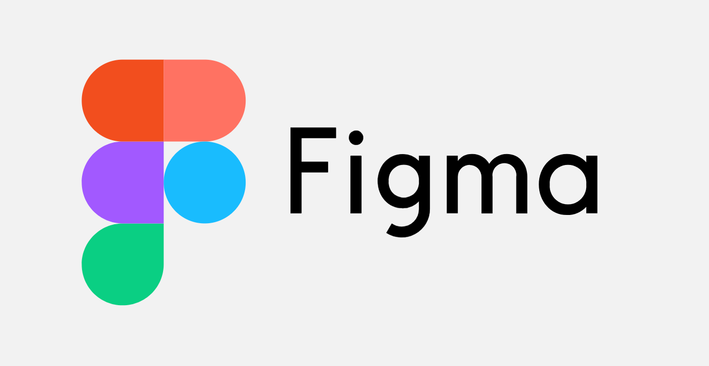
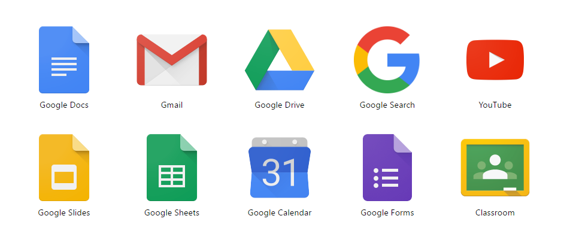

# Gerenciamento de Projeto
## Ambientes de trabalho
|Ambiente|Plataforma|Link de acesso|
|:--------:|:----------:|:--------------|
|Repositório de código e documentação|GitHub|https://github.com/ICEI-PUC-Minas-PMGCC-TI/tiaw-pmg-cc-m-20212-descontrole-financeiro-2
|Projetos de interface|Figma|https://www.figma.com/file/JrzEIMCcyWlQ0vveJPtSdR/Wireframe?node-id=243%3A1

  

## Organização da equipe
* **Equipe de desenvolvimento:**

  * Caio Henrique Alvarenga Gonçalves **`Desenvolvedor Front-End`**
  * Luan Tadeu Lima Rezende Dias **`Desenvolvedor Front-End`**
  * Luana Policarpo de Castro **`Desenvolvedora Front-End`**
  * Thiago Torres Santos **`Desenvolvedor Front-End`**
  * Vinícius Figueiredo Ferreira **`Desenvolvedor Front-End`**
  

## Ferramentas

As ferramentas empregadas no projeto são:

- Visual Studio Code
> O *Visual Studio Code* foi o editor de código escolhido porque possui uma integração com o
sistema de versão.
</img>
- Teams
> A plataforma *Teams* foi escolhida para a comunicação entre os integrantes do grupo por ser prática e consistente.
</img>
- Figma
> A plataforma *Figma* foi escolhida para o desenvolvimento dos wireframes e do user flow por recomendação dos professores da disciplina de TIAW.
</img>
- Replit
> A plataforma *Replit* foi escolhida para hospedar o site pela sua facilidade de uso.

</img>
- Google Sofwares
> Grande parte das ferramentas da *Google* são utilizadas no projeto, como o Slides, Docs, Drive e outros. Elas são modernas e intuitivas para exercer suas funções.
</img>
