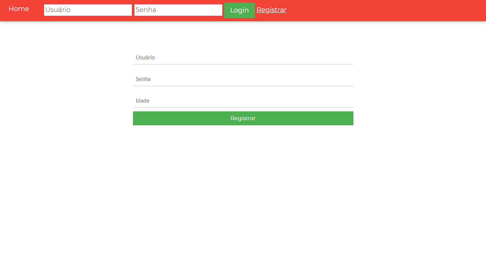
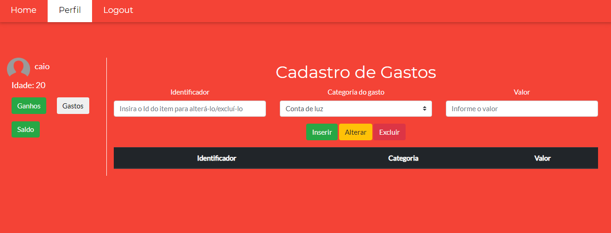
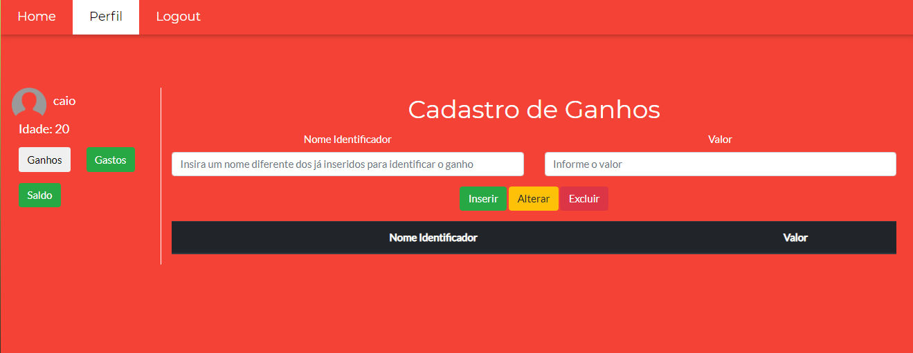
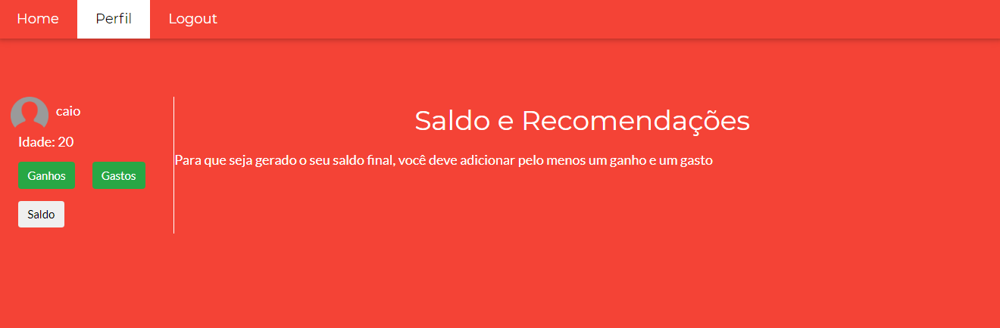

# Projeto da Solução

## Tecnologias utilizadas

A solução implementada conta com os seguintes módulos:
* Navegador - Interface básica do sistema 
* Páginas Web - Conjunto de arquivos HTML, CSS, JavaScript e imagens que implementam as funcionalidades do sistema.
* LocalStorage - armazenamento mantido no Navegador, onde são implementados bancos de dados baseados em JSON. São eles: 
  * Usuários - Registro de usuários da plataforma.
  * Gastos - Registro dos gastos mensais dos usuários da plataforma.
  * Ganhos - Registro dos ganhos mensais dos usuários da plataforma.
* Hospedagem - local na Internet onde as páginas são mantidas e acessadas pelo navegador. 
  
 

## Arquitetura da solução

# Funcionalidades do sistema
## Página de Login/Registro de novos usuários

*Descrição:* Cadastra novos usuários ou loga em um usuário existente utilizando o LocalStorage.
## Administração de Finanças -  Registro de Gastos

*Descrição:* Cadastro dos gastos de um usuário utilizando o LocalStorage.
## Administração de Finanças -  Registro de Ganhos

*Descrição:* Cadastro dos ganhos de um usuário utilizando o LocalStorage.
## Administração de Finanças -  Cálculo do saldo final

*Descrição:* Cálculo do saldo final a partir dos gastos e ganhos.Após determinar o saldo final, dependendo do resultado, a pagina mostra diferentes dicas para finanças.
